# Informações do Projeto
`TÍTULO DO PROJETO`  

CHIPOSTO

`CURSO` 

ENGENHARIA DE SOFTWARE

## Participantes
> Os membros do grupo são: 
> - Davi Érico dos Santos
> - Gabriel Arthur Vicentini
> - João Gabriel Maia da Costa
> - Leandro Caldas Pacheco
> - Lucas Alves Resende

# Estrutura do Documento

- [Informações do Projeto](#informações-do-projeto)
  - [Participantes](#participantes)
- [Estrutura do Documento](#estrutura-do-documento)
- [Introdução](#introdução)
  - [Problema](#problema)
  - [Objetivos](#objetivos)
  - [Justificativa](#justificativa)
  - [Público-Alvo](#público-alvo)
- [Especificações do Projeto](#especificações-do-projeto)
  - [Personas e Mapas de Empatia](#personas-e-mapas-de-empatia)
  - [Histórias de Usuários](#histórias-de-usuários)
  - [Requisitos](#requisitos)
    - [Requisitos Funcionais](#requisitos-funcionais)
    - [Requisitos não Funcionais](#requisitos-não-funcionais)
  - [Restrições](#restrições)
- [Projeto de Interface](#projeto-de-interface)
  - [User Flow](#user-flow)
  - [Wireframes](#wireframes)
- [Metodologia](#metodologia)
  - [Divisão de Papéis](#divisão-de-papéis)
  - [Ferramentas](#ferramentas)
  - [Controle de Versão](#controle-de-versão)
- [Projeto da Solução](#projeto-da-solução)
  - [Tecnologias Utilizadas](#tecnologias-utilizadas)
  - [Arquitetura da solução](#arquitetura-da-solução)
- [Avaliação da Aplicação](#avaliação-da-aplicação)
  - [Plano de Testes](#plano-de-testes)
  - [Ferramentas de Testes (Opcional)](#ferramentas-de-testes-opcional)
  - [Registros de Testes](#registros-de-testes)
- [Referências](#referências)

# Introdução

Durante a matéria Trabalho Interdisciplinar de Aplicações Web, levantamos alguns problemas
do mundo real para discutirmos e buscar soluções por meio da tecnologia. Com isso, reunimos um grupo de
sete alunos para desenvolver um software que nos auxilie a achar e classificar por preços os postos de gasolina mais baratos de determinada região.

## Problema

Dificuldade dos motoristas encontrarem os postos com melhor custo-benefício e avaliação da região além dos serviços gerais que apresentam os postos(restaurantes, lava-rápido, oficina, etc). 

## Objetivos

Oferecer uma experiência intuitiva ao usuário, listando e classificando por preços atualizados os postos de gasolina na região solicitada, além de apresentar classificação(estrelas, postos 24h,
com conveniência) dos postos apresentados. 

## Justificativa

Entrevistando alguns motoristas identificamos que o problema levantado afeta a grande
maioria, visto que o preço é variado e inconstante, surgindo a necessidade de visualizar em tempo real o valor do combustível nos estabelecimentos próximos.

## Público-Alvo

Principalmente motoristas.

 
# Especificações do Projeto

O projeto será desenvolvido totalmente para Web e visando ser o mais intuitivo e simples possível. Utilizaremos as tecnologias: Javascript, Html, API's, Bootstrap e Css para a estilização padrão do site.

## Personas e Mapas de Empatia

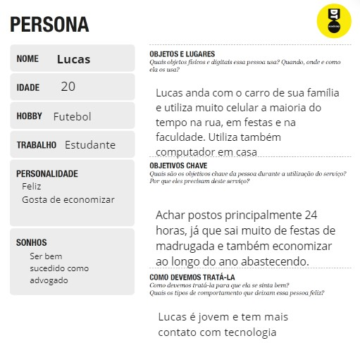

## Histórias de Usuários

Com base na análise das personas forma identificadas as seguintes histórias de usuários:

|EU COMO... `PERSONA`| QUERO/PRECISO ... `FUNCIONALIDADE` |PARA ... `MOTIVO/VALOR`                 |
|--------------------|------------------------------------|----------------------------------------|
|Usuário do sistema  | filtrar os postos    | achar apenas os com características desejadas               |
|Administrador       | Alterar permissões                 | Permitir que possam administrar contas |
|Usuário do sistema  | Registrar minha conta           | acessar o sistema
|Usuário do sistema  | acessar o site como visitante           | não perder tempo criando conta
|Usuário do sistema  | conseguir comentar           | deixar meu feedback do posto
|Usuário do sistema  | ordenar os postos de maneira dinâmica           | achar os postos mais pertos
|Usuário do sistema  | ordenar os postos de maneira dinâmica            | achar os postos mais baratos
|Usuário do sistema  | favoritar os postos           | poder encontrá-los facilmente depois
|Usuário do sistema  | ver o nível de estrelas dos postos         | selecionar aquele que tem os melhores feedbacks
|Usuário do sistema  | cadastrar meu posto no sistema       | outras pessoas possam ir até meu posto

## Requisitos

As tabelas que se seguem apresentam os requisitos funcionais e não funcionais que detalham o escopo do projeto.

### Requisitos Funcionais

|ID    | Descrição do Requisito  | Prioridade |
|------|-----------------------------------------|----|
|RF-001| Permitir que o usuário Filtre postos | ALTA | 
|RF-002| Permitir que o usuário Ordene postos  | ALTA |
|RF-003| Permitir que o usuário se Cadastre | ALTA |
|RF-004| Permitir que o usuário Envie um Formulário de Cadastro de Recomendação | ALTA |
|RF-005| Permitir que o usuário Favorite postos | ALTA |
|RF-006| Permitir que o usuário Comente sobre postos | ALTA |
|RF-007| Permitir que o usuário Avalie postos | ALTA |
|RF-008| Permitir que o administrador Cadastre os posto | ALTA |
|RF-009| Permitir que o usuário Busque sua localização ou Permita que use a sua localização | ALTA |
|RF-010| Permitir que o usuário Visualize o mapa da região definida e os postos desta região marcados no mapa | ALTA |
|RF-011| Permitir que o usuário Visualize os postos | ALTA |
|RF-012| Permitir que o administrador Crie notificações para serem enviadas aos usuários | ALTA |
|RF-013| Permitir que o usuário Visualize e Exclua as notificações que deseja | ALTA |
|RF-014| Permitir que o usuário Visualize os dados do usuário junto com os postos salvos | ALTA |
|RF-015| Login | ALTA |

### Requisitos não Funcionais

|ID     | Descrição do Requisito  |Prioridade |
|-------|-------------------------|----|
|RNF-001| O sistema deve ser responsivo para rodar em um dispositivos móveis | MÉDIA | 
|RNF-002| Deve ser extremamente intuitivo para todos os usuários | ALTA | 

## Restrições

O projeto está restrito pelos itens apresentados na tabela a seguir.

|ID| Restrição                                             |
|--|-------------------------------------------------------|
|01| O projeto deverá ser entregue até o final do semestre |
|02| Não pode ser desenvolvido em um módulo de backend |

# Projeto de Interface

[Projeto de Interface](https://www.figma.com/file/Gp52RF86vc9EpaY4deWWXG/Untitled?type=design&node-id=0-1&mode=design)

## User Flow

[User Flow](https://miro.com/app/board/uXjVMiYHZ2k=/)

## Wireframes

[WireFrame](https://miro.com/app/board/uXjVMiYHZ2k=/)

# Metodologia

- Organizamos tudo por meio do controle de versão do Git.
- Dividimos as funcionalidades individualmente de acordo com as entregas das Sprints 2 e 3.
- Realizaremos reuniões rápidas semanais para atualizarmos o grupo e verificarmos o que estava sendo feito e o que faltava fazer, para alinharmos o projeto
- Ao final, para a entrega da Sprint 4, juntamos todas as funcionalidades, fizemos ajustes nas funcionalidades que necessitavam de ajustes e descartamos as funcionalidades "desnecessárias" para o objetivo do projeto.

## Divisão de Papéis

- A parte de documentação será feita pelo grupo por inteiro, com todos tendo ciência de tudo que está sendo desenvolvido.
- Cada participante será responsável por um requisito a cada sprint, e cada requisito será relacionado a outro, assim possibilitando que seja desenvolvido em duplas a cada sprint.
- Nesta última Sprint, dividimos os papéis de acordo com o conhecimento de cada integrante sobre determinada funcionalidade e no momento final de juntar o sistema por inteiro fizemos os ajustes finais com o grupo inteiro.

## Ferramentas

| Ambiente  | Plataforma              |Link de Acesso |
|-----------|-------------------------|---------------|
|Processo de Design Thinkgin  | Miro | https://miro.com/welcomeonboard/elluVmxUV1lhZVJRZmpHWDViOTltd0xpMnRNSkdRRkVlYTNCV3gyWk5MSUlQYm1MNmwwYmNWbzBTZmRnM1VJR3wzNDU4NzY0NTY0NDI4NTcwNzk0fDI=?share_link_id=802009254278 | 
|Repositório de código | GitHub |https://github.com/ICEI-PUC-Minas-PMGES-TI/pmg-es-2023-2-ti1-2010100-encontrar-posto-mais-barato | 
|Hospedagem do site | Vercel | chiposto.vercel.app | 
|Protótipo Interativo | MavelApp ou Figma | https://www.figma.com/file/Gp52RF86vc9EpaY4deWWXG/Untitled?type=design&node-id=0-1&mode=design |  

## Controle de Versão

- Primeiramente organizaramos tudo através do controle versão por meio do Git, com commits explicativos e diretos na branch main para garantir o controle da aplicação. 

# Projeto da Solução

Prints da aplicação :
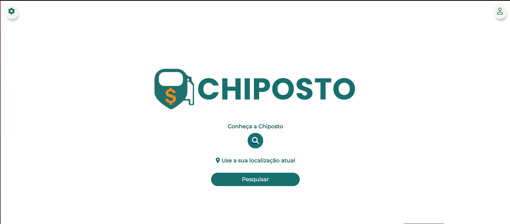
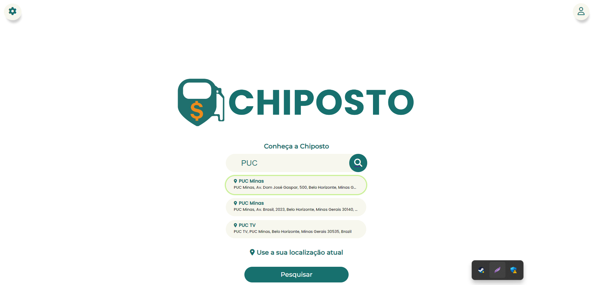
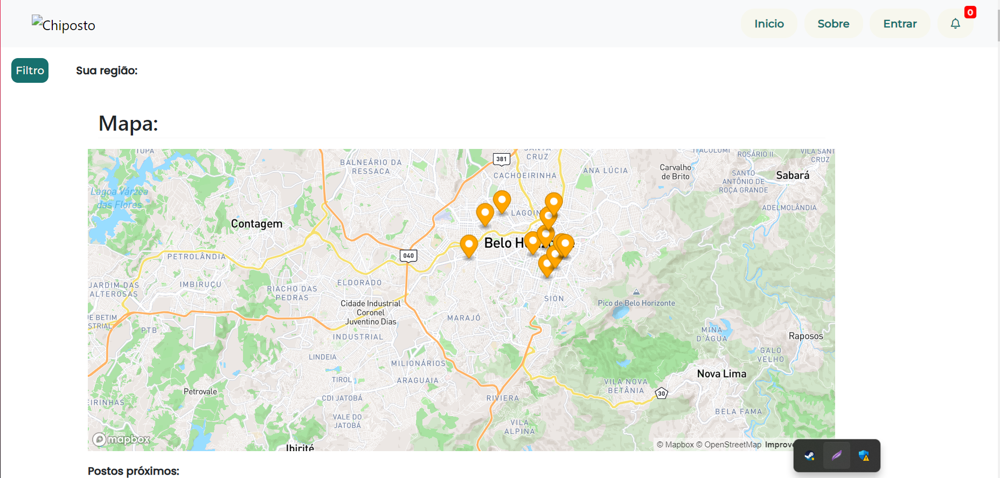
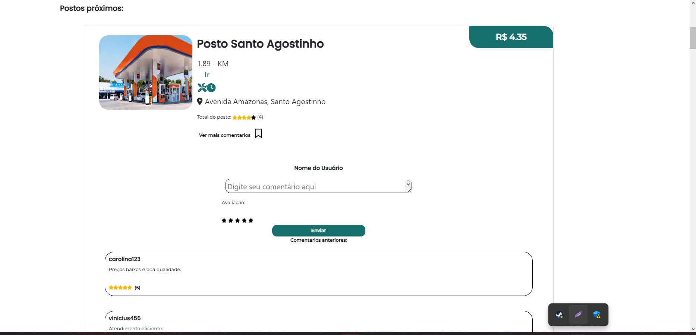
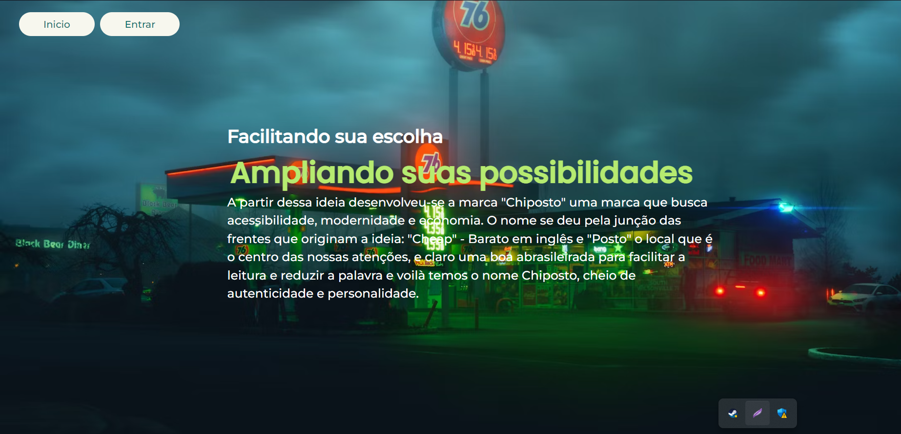
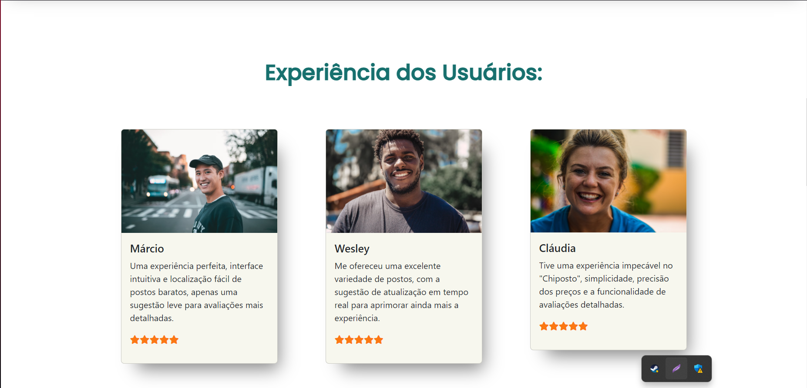
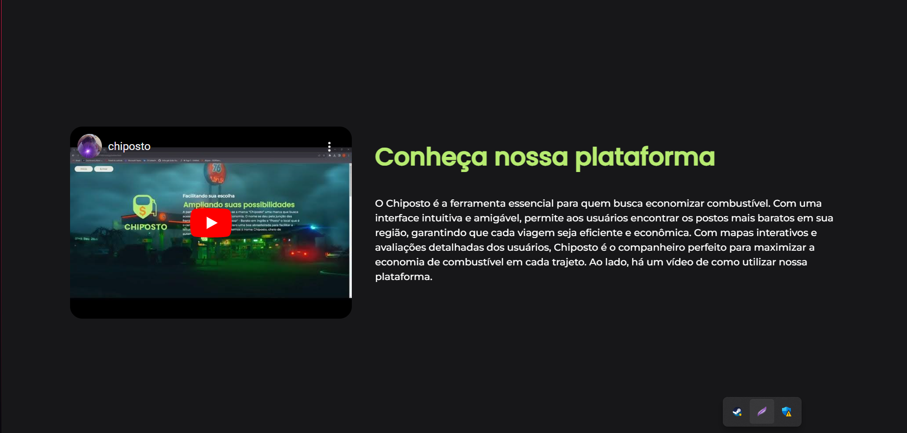
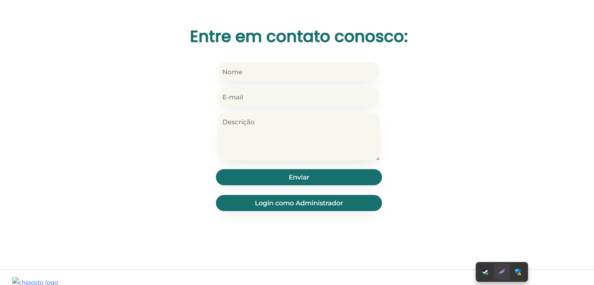
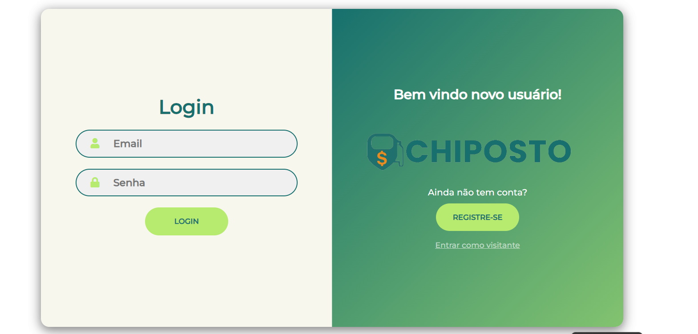
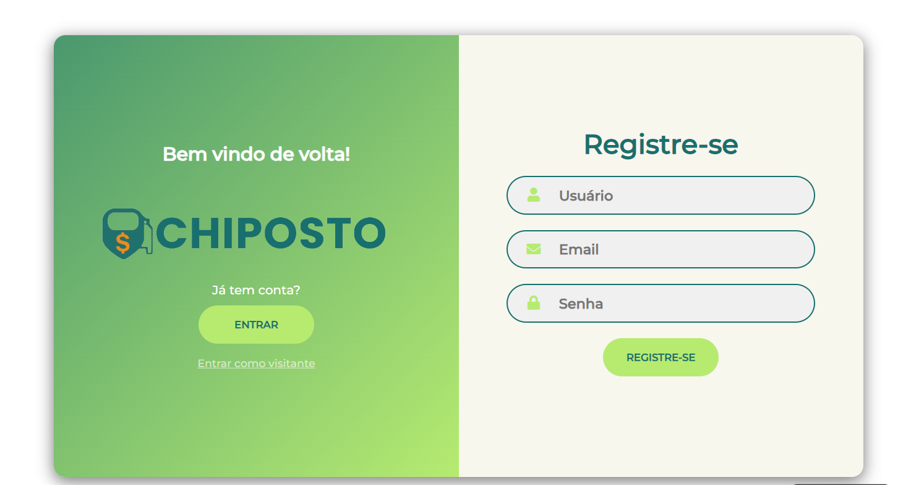
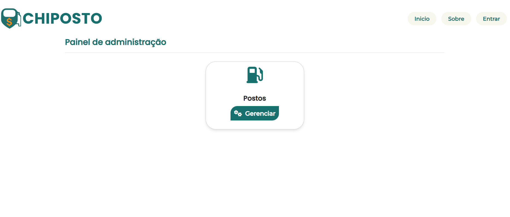
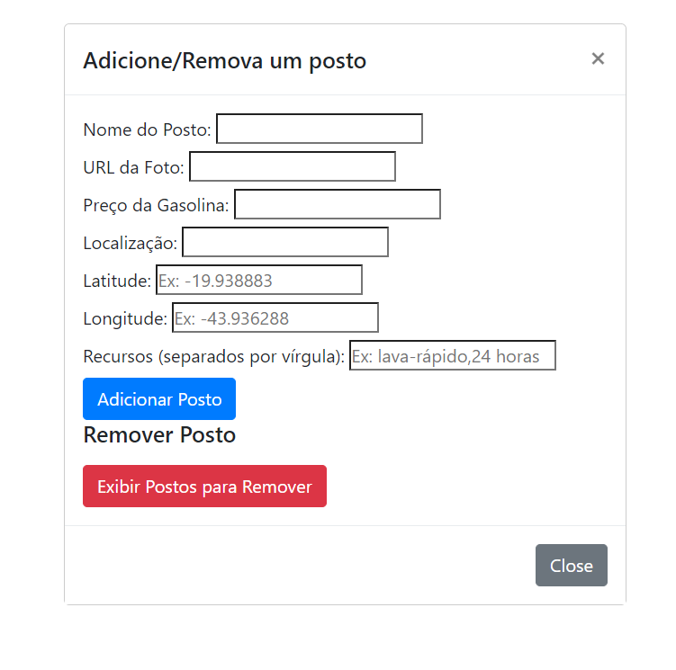
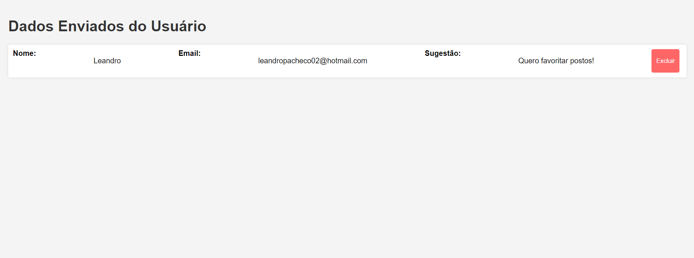

## Tecnologias Utilizadas

- Estruturação do Conteúdo com HTML:
  Implementação de uma estrutura sólida e semântica utilizando HTML para garantir a acessibilidade e indexação eficiente pelos motores de busca.

- Estilização com CSS:
  Utilização de folhas de estilo CSS para personalizar o design e a apresentação da aplicação, garantindo uma estética atraente e consistente.

- Frontend Responsivo:
  Utilização do framework Bootstrap para o desenvolvimento do frontend, garantindo uma interface responsiva e amigável para diversos dispositivos.

- Interatividade com JavaScript:
  Implementação de funcionalidades interativas na interface do usuário por meio da linguagem JavaScript, proporcionando uma experiência dinâmica.

- Comunicação com APIs RESTful:
  Integração de APIs RESTful para obter dados em tempo real dos fornecedores confiáveis de preços de combustíveis, assegurando informações precisas e atualizadas.

WIREFRAMES DAS TELAS:

Link: https://youtu.be/bp7wbFUloqY

## Arquitetura da solução

--- Sistema de Localização dos Postos da Região ---

- Interface de Usuários: Acessada por meio de navegadores web ou aplicativos móveis.
  Tecnologias: HTML, CSS, JavaScript

- Sistema de busca das localizações: Acesso às APIs através dos links de acesso e as chaves de acesso.
  Tecnologias: APIs e Mapa de Geolocalização

- Exibição e Cadastro das Informações: Integração das informações já exibidas e que serão cadastradas para o json server.
  Tecnologias: Json Server

- Diagrama de Arquitetura: https://lucid.app/lucidchart/8fc2a09a-1613-409f-9abd-00d0bb7affd3/edit?viewport_loc=512%2C60%2C2316%2C1290%2C0_0&invitationId=inv_e52aaae0-d43b-4085-9ef1-949927ab1b20

# Avaliação da Aplicação

- Os usuários conseguem navegar facilmente pela aplicação? Os elementos de design são intuitivos e contribuem para uma boa experiência do usuário?
- A aplicação possui funcionalidades indisponíveis? E as funcionalidades disponíveis funcionam como esperado?
- A aplicação é compatível com diferentes navegadores e dispositivos? Ela responde adequadamente a diferentes tamanhos de tela e sistemas operacionais?
- O código-fonte é organizado e fácil de entender? É simples adicionar novas funcionalidades ou corrigir problemas sem causar efeitos colaterais?

## Plano de Testes

Plano de Testes - CHIPOSTO

1- Objetivo: Validar todas as funcionalidades de acordo com o que elas foram propostas e o desempenho dela de acordo com o restante do sistema

2- Planejamento de Testes:
  * Todos os integrantes devem testar todas as funcionalidades desenvolvidas pelos próprios integrantes do grupo
  * Testar a compatibilidade entre as funcionalidades em cada tela e como a responsividade se comporta
  * Documentar todas as inconformidades apresentadas nos testes realizados por cada integrante
  * Executar todos os testes de forma manual

3- Riscos:
  - Riscos identificados: 
  * Possíveis atrasos na comunicação das APIs e do Json Server
  * Compatibilidade entre algumas responsividades
  - Estratégias prevenção: 
  * Monitoramento das comunicações das APIs
  * Monitorar a Responsividade do sistema
   
4- Critérios de Saída:
  Será concluído quando:
  * Todos os casos de teste planejados foram executados.
  * Problemas identificados forem resolvidos ou soluções novas serão implementadas/substituídas.
  * O Grupo irá revisar e aprovar os resultados dos testes.

5- Aprovação: Todos os testes foram revisados e aprovados por todos os integrantes do grupo
   Data: 11/12/2023
  

## Registros de Testes

- Resultados: Cada integrante do grupo teve um resultado diferente com cada bateria de testes realizada. Mesmo os testes que não foi encontrado nenhuma inconformidade, foi observado que algumas funcionalidades poderiam ser editadas, principalmente em suas partes de estilização.
Um resultado impactante foi na filtragem e no momento de salvar os cards que estava afetando na exibição dos cards, com isso tivemos que realizar mudanças drásticas na estruturação do código e na junção das funcionalidades.

- Pontos observados: A maior parte das funcionalidades que estavam funcionando separadamente ao juntar com o restante do código foi apresentada pelo menos uma falha mínima.

- Como resolver as exigências estabelecidas durante o período dos testes: Pegamos o sistema como um todo que estava apresentando alguns problemas e colocamos diferentes visões de desenvolvimento para solucionar cada caso, isso facilitou na hora de integrarmos os códigos novamente e nos mostrou uma forma diferente de colocar as melhorias em prática.

# Referências

- Aulas da disciplina Desenvolvimento de Interfaces Web - Engenharia de Software 
- W3Schools
- Videos de Formulários Responsivos(Youtube.com)
- Bootstrap
- Replit
- Git
- Referências Bibliográficas: * motoristas.shtml#:~:text=O%20número%20de%20carteiras%20de,cresceu%2010%%20no%20mesmo%20período
https://www.mutuus.net/blog/empresas-de-logistica/#:~:text=Mais%20precisamente%2C%20no%20país%20existem,empresas%20de%20logística%20e%20transporte
  * https://observatoriodabicicleta.org.br/pesquisa-inedita-revela-numero-estimado-de-bicicletas-no-brasil/#:~:text=Uma%20pesquisa%20feita%20pela%20especialista,de%2033%20milhões%20de%20bicicletas
https://www1.folha.uol.com.br/cotidiano/2020/07/numero-de-cnhs-cresce-38-em-10-anos-e-cai-proporcaode-jovens-

